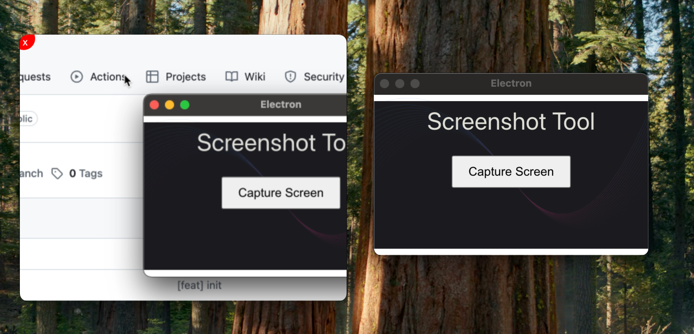

1. 这是一款截图工具, 只需要在macos上运行, 最好是typescript编写的, 可以以浏览器应用方式运行.
2. 功能是支持用鼠标左键选择一块区域, 松开鼠标后弹出一个选择栏, 有4个选项: 取消, 保存到粘贴板, 保存到指定目录, 选中并移动.
3. 取消: 放弃选择, 恢复到初始状态.
4. 保存到粘贴板: 截图并保存到粘贴板.
5. 保存到指定目录: 截图并保存到指定目录.
6. 选中并移动: 截图后, 可以用鼠标拖动截图到指定位置, 截图左上方有个关闭按钮, 点击关闭后恢复到初始状态.
